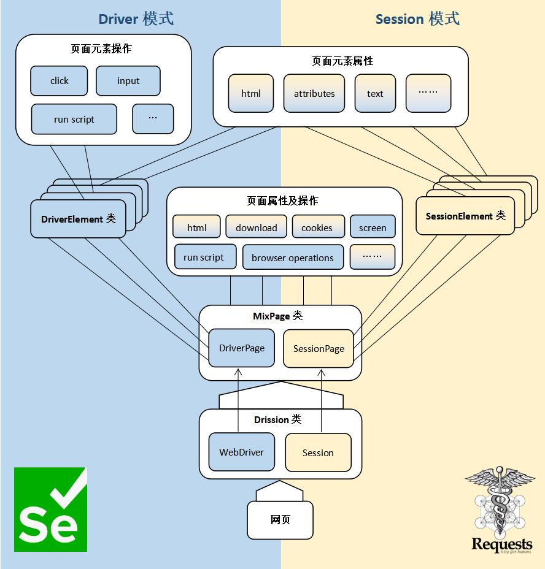

🛠 Old Version (MixPage)
---

The versions of this repository prior to 3.0 were implemented by re-encapsulating selenium.

The page objects for this version are `MixPage` and `DriverPage`, corresponding to `WebPage` and `ChromiumPage` of DrissionPage. The usage is basically the same as the new version.

After years of use, the old version has become quite stable. However, due to reliance on selenium, the development of functions has been greatly restricted. Moreover, with the iteration of versions, the new version has surpassed the old version comprehensively, and it is time for the old version to retire.

Therefore, starting from version 3.0, the old version code has been separated from this repository and developed into an independent library.

This is to commemorate the achievements it has made.

Currently, the development of the old version has been frozen. Except for bug fixes, there will be no more functional modifications for the old version.

Interested readers can take a look.

---

Project address: [MixPage](https://gitee.com/g1879/MixPage)

Documentation: [MixPage User Manual](http://g1879.gitee.io/mixpage)

---

The structure of `MixPage` is as follows:

