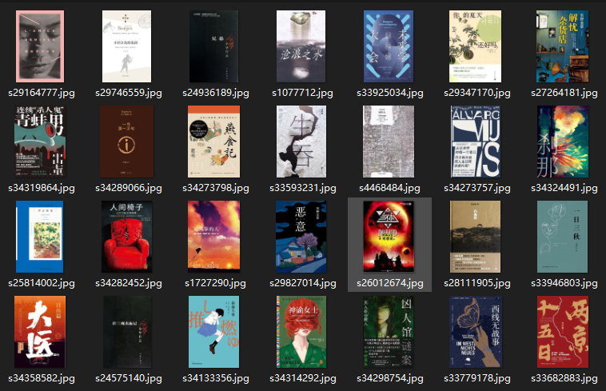

🌠 Download Douban Book Covers
---

The example from Starbucks uses the `download()` method to download images. This example demonstrates how to directly save images in a browser.

This feature is a highlight of this library. It does not require any UI operations or re-downloading of images. Instead, it directly reads and saves images from the cache, making it very convenient to use.

## ✅️️ Page Analysis

Target URL: [https://book.douban.com/tag/小说](https://book.douban.com/tag/%E5%B0%8F%E8%AF%B4)

By pressing `F12`, you can see that each book is contained in an element with the `class` attribute set to `subject-item`. You can retrieve them in batches and then retrieve the `` element to save the image.

---

## ✅️️ Coding Approach

In order to demonstrate the `save()` method of the element object, we will use browser operations to save the image files to the local `imgs` folder.

---

## ✅️️ Example Code

The following code can be run directly.

```python
from DrissionPage import ChromiumPage

# Create a page object
page = ChromiumPage()
# Visit the target webpage
page.get('https://book.douban.com/tag/小说?start=0&type=T')

# Scrape 4 pages
for _ in range(4):
    # Iterate through all the books on a single page
    for book in page.eles('.subject-item'):
        # Get the cover image object
        img = book('t:img')
        # Save the image
        img.save(r'.\imgs')

    # Click the next page
    page('后页>').click()
    page.wait.load_start()
```

---

## ✅️️ Result



