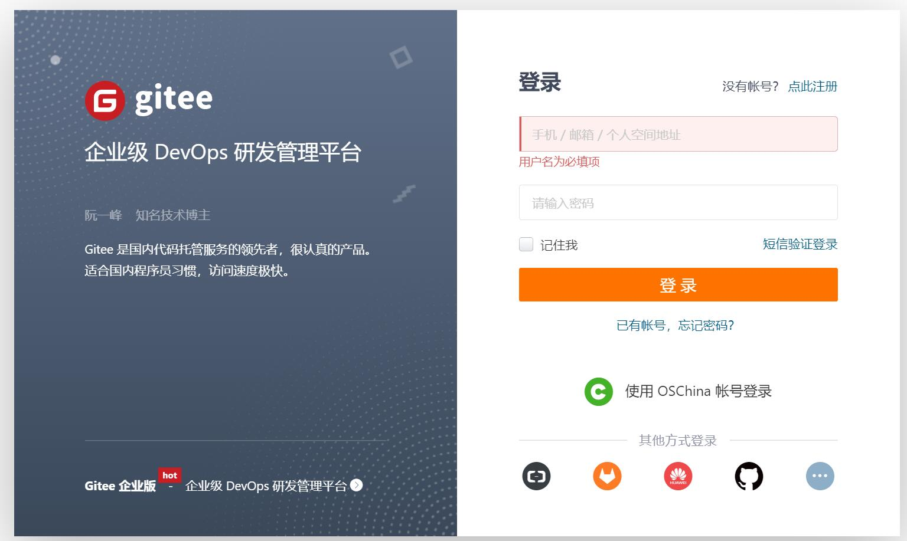
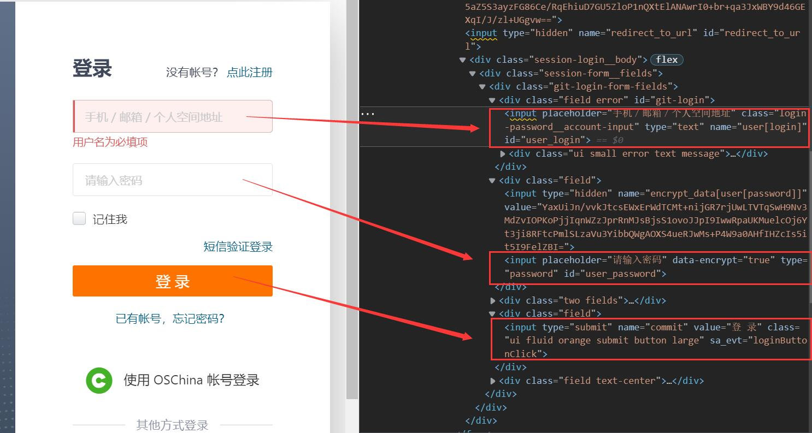

🌠 Gitee Auto Login
---

This example demonstrates how to automatically login to the Gitee website by controlling the browser.

## ✅️️ Web Analysis

URL: https://gitee.com/login



Press `F12` to view the code, and you can see that both input boxes can be located using the `id` attribute, as shown in the image.



---

## ✅️️ Coding Idea

Elements with the `id` attribute are easy to locate. Both input boxes can be directly located using the `id` attribute.  
The login button does not have an `id` attribute, but it can be observed that it is the first element with the `value` attribute set to `'登 录'`, so it can also be located using the Chinese text for better code readability.

Since we are using a browser for logging in, we will use `ChromiumPage` to control the browser.

---

## ✅️️ Sample Code

```python
from DrissionPage import ChromiumPage

# Create a page object in 'd' mode (default mode)
page = ChromiumPage()
# Navigate to the login page
page.get('https://gitee.com/login')

# Locate the account input box and enter the account
page.ele('#user_login').input('Your account')
# Locate the password input box and enter the password
page.ele('#user_password').input('Your password')

# Click the login button
page.ele('@value=登 录').click()
```

---

## ✅️️ Result

Login successful.


