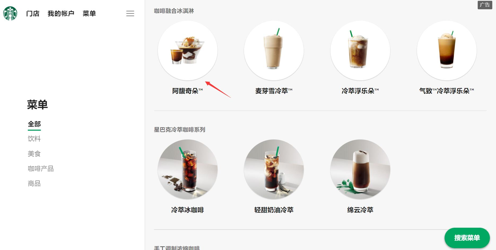
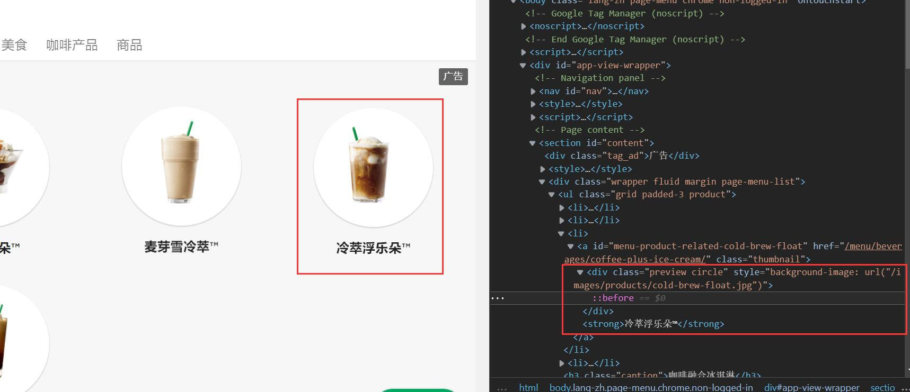
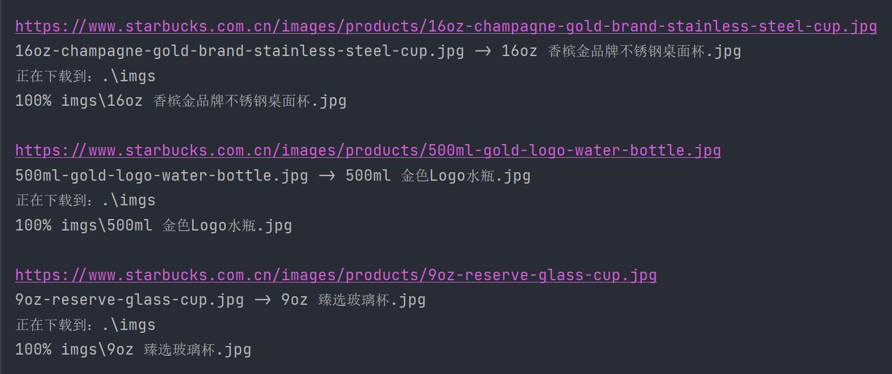
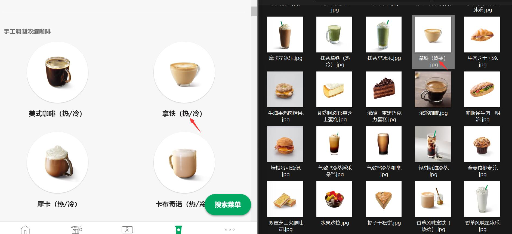

🌠 Download Starbucks Product Images
---

This example demonstrates the functionality of the `download()` method.

## ✅️️ Page Analysis

Target URL: https://www.starbucks.com.cn/menu/

Goal: Download all product images and name them based on the product name.

As shown in the screenshot below:



By inspecting the webpage using F12, we can see that each product image is contained within a `div` element with the `class` attribute set to `preview circle`. The image URL is hidden within the `style` attribute of the `div` element. The product name is located in a separate element following this `div` element.

As shown in the screenshot below:



---

## ✅️️ Encoding Logic

Based on the webpage structure, we can fetch all elements with the `class` attribute set to `preview circle`, iterate through them, and extract the image path and product name. We can then proceed to download the images.

Additionally, since the webpage structure is simple and does not use JavaScript to generate content, we can directly access it using a secure connection.

---

## ✅️️ Sample Code

```python
from DrissionPage import SessionPage
from re import search

# Create a session page object using secure connection
page = SessionPage()
# Access the target webpage
page.get('https://www.starbucks.com.cn/menu/')

# Get all elements with class attribute set to 'preview circle'
divs = page.eles('.preview circle')
# Iterate through these elements
for div in divs:
    # Use relative positioning to fetch the next sibling element of the current div element and retrieve its text
    name = div.next().text

    # Extract the image URL from the style attribute of the div element and concatenate it
    img_url = div.attr('style')
    img_url = search(r'"(.*)"', img_url).group(1)
    img_url = f'https://www.starbucks.com.cn{img_url}'

    # Perform the download
    page.download(img_url, r'.\imgs', rename=name)
```

:::tip Tips
    You do not need to manually create the `imgs` folder as it will be automatically created by the `download()` method.
:::

---

## ✅️️ Results



During program execution, the download progress is printed by default.



We noticed that some product names contain `/`, which is an illegal character in file paths. This would typically require manual handling by the programmer when downloading files. However, the `download()` method in DrissionPage has built-in functionality to remove illegal characters and ensure successful file saving. Additionally, if there are conflicting filenames in the specified save path, this method automatically renames the new file by adding a serial number to avoid path conflicts. The method also returns the absolute path of the downloaded file, making it convenient for further program usage.

:::tip Tips
    When encountering conflicting filenames, the `download()` method provides three options: `skip`, `overwrite`, and `rename`.
:::

