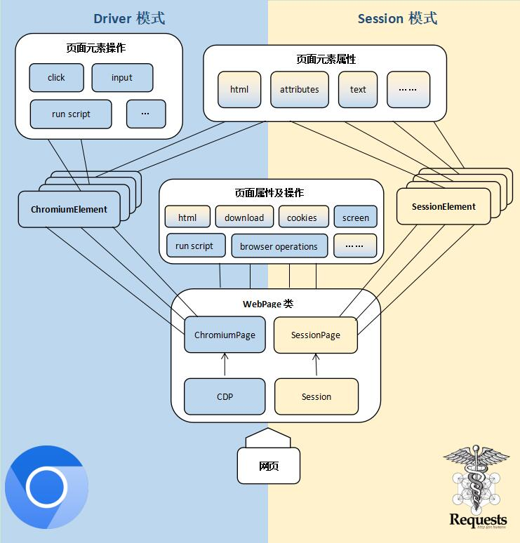

## ☀️ Basic Concepts

This section explains some basic concepts of DrissionPage and gives an overview of its structure.

If you find it a bit confusing, you can skip this section directly.

## ✅️️ Web Automation

There are usually two forms of web automation, each with its own advantages and disadvantages:

- Sending data packets directly to the server to retrieve the required data.
- Interacting with the browser and web pages.

The former is lightweight, fast, and suitable for multi-threading and distributed deployment, such as the requests library. However, when the data packet becomes complex, or even when encryption technology is added, the complexity of the development process increases significantly.

Therefore, DrissionPage integrates the two forms by treating web pages as units, and re-encapsulates the Chromium protocol and requests to achieve interoperability between the two modes. It also adds commonly used page and element control functions, which greatly reduces the difficulty and amount of development.
The object used to manipulate the browser is called Driver, and the object used to manage connections is called Session. Drission is the combination of the two. The Page represents the encapsulation in POM mode.
In the previous version, this library was implemented by re-encapsulating selenium and requests.
Starting from version 3.0, the author started from scratch and implemented all the features of selenium using the chromium protocol, thus eliminating the dependency on selenium. It has more features, stronger performance, and more flexible development.

If you want to learn about the old version, please refer to the chapter "Old Version Usage".

## ✅️️ Basic Usage Logic

Whether it is browser control or sending and receiving data packets, the operational logic is the same.

That is, first create a page object, and then obtain element objects from the page object. By reading or operating on the element objects, data acquisition or page control can be achieved.

Therefore, the most important objects are the page object and the element object generated from it.

---

## ✅️️ Main Objects

There are three commonly used types of page objects:

- `ChromiumPage`: The page object used solely for browser control.
- `SessionPage`: The page object used solely for sending and receiving data packets.
- `WebPage`: The page object that integrates both browser control and sending and receiving data packets.

### 📌 `ChromiumPage`

`ChromiumPage` is the page object used for browser control. It is used solely for controlling the browser, and cannot send or receive data packets. It supports Chromium-based browsers such as Chrome, Edge, etc. When creating a page object, the program automatically starts the browser. If a browser with the specified port already exists, it takes over that browser.

:::warning Note
    Before trying the following code, please close any open Chrome browsers.<br/>If the startup fails, please refer to the "Preparation" section in the "Getting Started" guide for browser configuration.
:::

```python
from DrissionPage import ChromiumPage

# Create a page object
page = ChromiumPage()
# Control the browser to visit Baidu
page.get('https://www.baidu.com')
# Locate the input box and enter the keyword
page.ele('#kw').input('DrissionPage')
# Click the "百度一下" button
page.ele('@value=百度一下').click()
```

---

### 📌 `ChromiumElement`

The `ChromiumElement` object is an element object on a browser page. It can perform operations such as clicking, entering text, dragging, and running JavaScript scripts on the elements in the browser. It can also find its sub-elements or adjacent elements based on this element.

```python
# Get the element object with ID 'kw'
ele = page('#kw')
# Click the element
ele.click()
# Enter text
ele.input('some text')
# Get the class attribute
attr = ele.attr('class')
# Set the style attribute
ele.set.attr('style', 'display:none;')
# Get all the 'a' elements among its sub-elements
links = ele.eles('tag:a')
```

In addition to the most commonly used `ChromiumElement` object, the browser also produces `ChromiumFrame`, `ShadowRoot`, and `ChromiumTab` objects. See the relevant chapters for detailed usage.

---

### 📌 `SessionPage`

`SessionPage` is the page object used for sending and receiving data packets. It is used solely for sending and receiving data packets, and cannot control the browser.

```python
from DrissionPage import SessionPage

# Create a page object
page = SessionPage()
# Visit Baidu
page.get('https://www.baidu.com')
# Get the element object
ele = page('#kw')
# Print the element's HTML
print(ele.html)
```

**Output:**

```shell
<input id="kw" name="wd" class="s_ipt" value="" maxlength="255" autocomplete="off">
```

---

### 📌 `SessionElement`

The `SessionElement` object is an element object generated by `SessionPage`. It can read the element information, or find sub-elements or position other elements based on it, but it cannot perform operations such as clicking.
This type of object has a very high parsing efficiency. When the web page is too complex, it can convert the `ChromiumElement` element to a `SessionElement` for parsing to improve speed. At the same time, subordinate elements can be searched during the conversion.

```python
# Get the tag attribute of the element
tag = ele.tag
# Find the first sub-element with name 'name1' under the element
ele1 = ele.ele('@name=name1')
```

---

### 📌 `WebPage`

The WebPage object integrates both the browser control and the ability to send and receive data packets, and can share login information between the two.

It has two working modes: d mode and s mode. The d mode is used for browser control, while the s mode is used for sending and receiving data packets. The WebPage can switch between the two modes, but can only be in one mode at a time.

In d mode, the elements obtained by WebPage are ChromiumElement, and in s mode, the elements obtained are SessionElement.

```python
from DrissionPage import WebPage

# Create a WebPage object
page = WebPage()
# Access a website
page.get('https://gitee.com/explore')
# Find the text box element and enter a keyword
page('#q').input('DrissionPage')
# Click the search button
page('t:button@tx():搜索').click()
# Wait for the page to load
page.wait.load_start()
# Switch to data packet mode
page.change_mode()
# Get all row elements
items = page('#hits-list').eles('.item')
# Iterate through the elements
for item in items:
    # Print the element text
    print(item('.title').text)
    print(item('.desc').text)
    print()
```

**Output:**

```shell
g1879/DrissionPage
Based on Python web automation tool. It can control the browser and send/receive data packets. It can balance the convenience of browser automation and the efficiency of requests. It has powerful functionality, built-in numerous user-friendly designs and convenient features. The syntax is concise and elegant, with less code.

mirrors_g1879/DrissionPage
DrissionPage

g1879/DrissionPageDocs
DrissionPage documentation
```

For detailed usage, see the "Creating Page Objects" and "Operating Pages" sections.

---

## ✅️️ Object Relationship Diagram

The following diagram lists the generation relationships of various objects used in this library.

```
├─ SessionPage
|     └─ SessionElement
|           └─ SessionElement
├─ ChrmoiumPage
|     ├─ ChromiumTab
|     |     └─ ChromiumElement
|     |     └─ SessionElement
|     ├─ ChromiumFrame
|     |     └─ ChromiumElement
|     |     └─ SessionElement
|     ├─ ChromiumElement
|     |     └─ ChromiumElement
|     |     └─ SessionElement
|     └─ ChromiumShadowElement
|           └─ ChromiumElement
|           └─ SessionElement
├─ WebPage
|     ├─ ChromiumTab
|     |     └─ ChromiumElement
|     |     └─ SessionElement
|     ├─ ChromiumFrame
|     |     └─ ChromiumElement
|     |     └─ SessionElement
|     ├─ ChromiumElement
|     |     └─ ChromiumElement
|     |     └─ SessionElement
|     ├─ ChromiumShadowElement
|     |     └─ ChromiumElement
|     |     └─ SessionElement
|     └─ SessionElement
|           └─ SessionElement
├─ SessionOptions
└─ ChrmoiumOptions
```

---

## ✅️️ Working Modes

As mentioned above, the WebPage object can control the browser and access network data in two modes: d mode and s mode.
The page object can switch between these two modes, with consistent usage methods, but can only be in one mode at any given time.

### 📌 d mode

The d mode represents Driver and Dynamic. 
The d mode is used for browser control, allowing not only reading information obtained by the browser, but also manipulating the page, such as clicking, filling in forms, toggling tabs, changing element attributes, and executing JavaScript scripts, etc. 
The d mode is powerful, but its runtime is significantly slower due to browser restrictions and consumes a large amount of memory.

---

### 📌 s mode

The s mode represents Session, Speed, and Silence.
The s mode runs several orders of magnitude faster than the d mode, but can only read or send data based on data packets and cannot manipulate the page or run JavaScript.
When crawling data, if the website data packets are relatively simple, the s mode is preferred.

---

### 📌 Mode Switching

The WebPage object can switch between d mode and s mode, which is usually used in the following scenarios:

- When the login verification is strict and difficult to deconstruct, such as when there is a CAPTCHA, use the browser to handle the login, and then switch to s mode to crawl data. This avoids dealing with complex JavaScript and allows for faster processing with the s mode.
- When the page data is generated by JavaScript and the page structure is extremely complex, you can use the d mode to read the page elements, and then convert the elements to s mode elements for analysis. This can significantly improve the processing speed of the d mode.

In the above two scenarios, the first one involves converting the entire page object:

```python
page.change_mode()
```

The second one involves converting only certain elements to s mode while in d mode, such as converting table elements to s mode elements, which can be several orders of magnitude faster than directly parsing d mode elements. It is even possible to convert the entire page to s mode elements.

```python
# Get the table element on the page
ele = page.ele('tag:table')
# Convert the element to s mode element
ele = ele.s_ele()
# Get all row elements
rows = ele.eles('tag:tr')
```

---

## ✅️️ Structure Diagram

`WebPage` inherits from `ChromiumPage` and `SessionPage`. The former is responsible for controlling the browser, and the latter is responsible for sending and receiving data packets. Therefore, `WebPage` can control the browser, send and receive data packets, and share login status in both modes.



---

## ✅️️ Configuration Management

Both requests and browsers usually require some configuration information to work properly, such as the long `user_agent`, the path of the browser exe file, and browser configurations.
This code is often cumbersome and repetitive, which is not conducive to code simplicity.  
Therefore, DrissionPage uses a configuration file to record common configuration information, and the program will automatically read the contents of the default configuration file. Therefore, in the example, you usually can't see the code for the configuration information.

This feature supports users to save different configuration files and choose according to the situation. It can also support writing configurations directly in the code to shield the reading of configuration files.

:::tip Tips
    When you need to package the program, you must write the configuration in the code or manually copy the configuration file to the running path after packaging, otherwise an error will occur. See relevant sections for details.
:::

### 📌 `SessionOptions`

Configuration object for `SessionPage` and `WebPage` s mode.

---

### 📌 `ChromiumOptions`

Configuration object for `ChromiumOptions` and `WebPage` d mode.

---

## ✅️️ Locators

Locators are used to locate elements on the page. They are a major feature of this library and can be used to retrieve elements in a very concise way, making it simple and easy to use. The readability and usability are higher than other methods such as xpath, and it is compatible with xpath, css selector, and selenium locators.

Here is a comparison:

Locate the element that contains the text `'abc'`:

```python
# DrissionPage
ele = page('abc')

# selenium
ele = driver.find_element(By.XPATH, '//*[contains(text(), "abc"]')
```

Locate the element with class name `'abc'`:

```python
# DrissionPage
ele = page('.abc')

# selenium
ele = driver.find_element(By.CLASS_NAME, 'abc')
```

Locate the sibling element of ele element:

```python
# DrissionPage
ele1 = ele.next()  # Get the next element
ele1 = ele.prev(index=2)  # Get the second previous element

# selenium
ele1 = ele.find_element(By.XPATH, './/following-sibling::*')  # Get the next element
ele1 = ele.find_element(By.XPATH, './/preceding-sibling::*[2]')  # Get the second previous element
```

Clearly, the locator statements in this library are more concise and easy to understand. There are also many flexible and easy-to-use methods, see the "Find Elements" section for more details.

