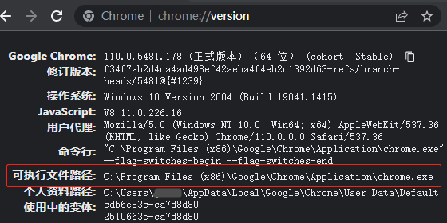

🌏 Preparations
---

Before we begin, let's do some simple setup.

If you only need to send and receive data packets, no preparation is required.

If you want to control a browser, you need to set the path to the browser. By default, the program is set to control Chrome, so Chrome will be used in the following demonstration. The same method can be used to set up Edge or other Chromium-based browsers.

:::warning Note
    The author has found some strange issues with Chrome version 92, which prevents it from starting on some computer environments. Please avoid using this version if possible.
:::

## ✅️️ Steps to Follow

### 1️⃣ Attempt to Start the Browser

By default, the program will automatically search for the Chrome path in the system.

Execute the following code. If the browser starts and accesses the project documentation, it means that you can use it directly and skip the following steps.

```python
from DrissionPage import ChromiumPage

page = ChromiumPage()
page.get('http://g1879.gitee.io/DrissionPageDocs')
```

---

### 2️⃣ Set the Path

If the previous step prompts an error, it means that the program did not find the Chrome browser in the system.

You can use one of the methods below to set the path. The setting will be recorded in the default configuration file and will be used by the program for future startups.

:::tip How to Obtain the Browser Path
    - The browser path here does not necessarily have to be Chrome; it can be any Chromium-based browser like Edge.
    - Open the browser and enter `chrome://version` in the address bar (or `edge://version` for Edge), then press Enter.
      
    The red box in the image shows the path you need to obtain.  
    This method is not limited to Windows; you can also use it to obtain the path on Linux with a graphical interface.    
:::

**🔸 Method 1:**

Create a temporary Python file and enter the following code, replacing the path with the executable file path of Chrome on your computer. Then, run the file.

```python
from DrissionPage import ChromiumOptions

path = r'D:\Chrome\Chrome.exe'  # Please change to the executable file path of Chrome on your computer
ChromiumOptions().set_browser_path(path).save()
```

This code will record the browser path in the configuration file, and the browser will be launched using the new path in the future.

Additionally, if you want to temporarily switch the browser path to test if it runs and operates normally, you can remove `.save()` and use the following code in conjunction with the code from step 1️⃣.

```python
from DrissionPage import ChromiumPage, ChromiumOptions

path = r'D:\Chrome\Chrome.exe'  # Please change to the executable file path of Chrome on your computer
co = ChromiumOptions().set_browser_path(path)
page = ChromiumPage(co)
page.get('http://g1879.gitee.io/DrissionPageDocs')
```

**🔸 Method 2:**

Enter the following command in the command line (replace the path with the one on your computer):

```shell
dp -p D:\Chrome\chrome.exe
```

:::warning Note
    - Make sure that the Python environment in the command line is the same as the project environment.
    - Make sure to use the `cd` command to navigate to the project path first.
:::

---

### 3️⃣ Retry Controlling the Browser

Now, please re-execute the code from step 1️⃣. If it successfully accesses the project documentation, it means that the setup is complete.

```python
from DrissionPage import ChromiumPage

page = ChromiumPage()
page.get('http://g1879.gitee.io/DrissionPageDocs')
```

---

## ✅️️ Explanation

Once you have completed the preparations, there is no need to close the browser. You can continue to use the current browser for the examples that follow.

