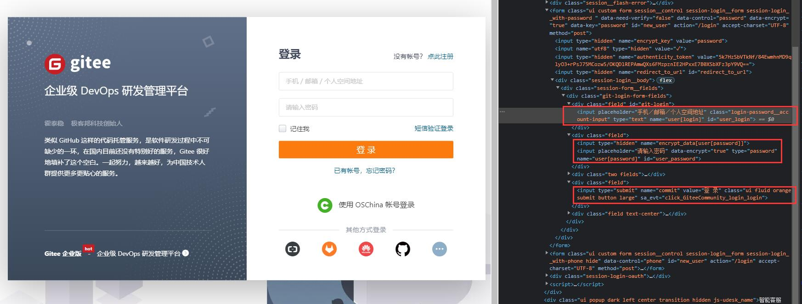

🗺️ Controlling the Browser
---

Now, let's understand how DrissionPage works through some examples.

This example demonstrates the use of `ChromiumPage` to control the browser login to the gitee website.

## ✅️️ Page Analysis

URL: [https://gitee.com/login](https://gitee.com/login)

When we open the URL and press F12, we can see the HTML of the page as follows:



The username input box has an `id` of `'user_login'`, the password input box has an `id` of `'user_password'`, and the login button has a `value` of `'登录'`.

We can locate these three elements using these three attributes and then input data and click on them.

---

## ✅️️ Sample Code

You can copy the following code to your editor, change the account and password to your own, and execute it directly to see the results.

```python
from DrissionPage import ChromiumPage

# Create a page object and start or take over the browser
page = ChromiumPage()
# Navigate to the login page
page.get('https://gitee.com/login')

# Locate the username textbox and get the element
ele = page.ele('#user_login')
# Input the account into the textbox
ele.input('Your account')
# Locate the password textbox and input the password
page.ele('#user_password').input('Your password')
# Click the login button
page.ele('@value=登录').click()
```

---

## ✅️️ Sample Explanation

Let's go through the code line by line:

```python
from DrissionPage import ChromiumPage
```

↑ First, we import the `ChromiumPage` class for controlling the browser.

```python
page = ChromiumPage()
```

↑ Next, we create a `ChromiumPage` object.

```python
page.get('https://gitee.com/login')
```

↑ The `get()` method is used to visit the given URL. It will wait for the page to load completely before executing the subsequent code. You can also modify the wait strategy, such as waiting for the DOM to load without waiting for resource downloading, by stopping the loading. This will be explained in later sections.

```python
ele = page.ele('#user_login')
```

↑ The `ele()` method is used to find elements, and it returns a `ChromiumElement` object for manipulating the element.

`'#user_login'` is the locator text, and `#` means locating the element by the `id` attribute.

It is worth mentioning that `ele()` has built-in waiting. If the element is not loaded, it will wait until the element appears or the time limit is reached. The default timeout is 10 seconds.

```python
ele.input('Your account')
```

↑ The `input()` method is used to input text into the element.

```python
page.ele('#user_password').input('Your password')
```

↑ We can also perform chained operations, directly getting the element and inputting text.

```python
page.ele('@value=登录').click()
```

↑ After inputting the account and password, we get the button element using the same method and perform a click operation on it.

The difference is that this time we search by its `value` attribute. `@` denotes searching by attribute name.

By doing this, we have completed the automatic login operation on the gitee website.

