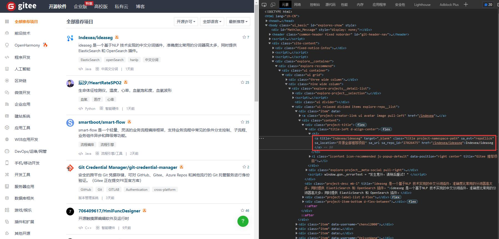

🗺️ Sending and Receiving Data Packets
---

This example demonstrates how to use the `SessionPage` to collect data from the gitee website by sending and receiving data packets.

This example does not use a browser.

## ✅️️ Page Analysis

URL: [https://gitee.com/explore/all](https://gitee.com/explore/all)

The goal of this example is to retrieve the names and links of all repositories. To avoid putting pressure on the website, we will only collect data from 3 pages.

Open the URL, press `F12`, and we can see the HTML of the page as follows:



From the HTML code, we can see that the titles of all open source projects are `<a>` elements with a `class` attribute of `'title project-namespace-path'`. We can iterate through these `<a>` elements to retrieve their information.

At the same time, we observe that the URLs of the list pages are accessed with the page number as a parameter. For example, the URL of the first page is `https://gitee.com/explore/all?page=1`, where the page number is the `page` parameter. Therefore, we can access different pages by modifying this parameter.

---

## ✅️️ Example Code

The following code can be run directly to see the results:

```python
from DrissionPage import SessionPage

# Create a page object
page = SessionPage()

# Crawl 3 pages
for i in range(1, 4):
    # Visit a specific page
    page.get(f'https://gitee.com/explore/all?page={i}')
    # Get a list of all repository <a> elements
    links = page.eles('.title project-namespace-path')
    # Iterate through all <a> elements
    for link in links:
        # Print link information
        print(link.text, link.link)
```

**Output:**

```shell
小熊派开源社区/BearPi-HM_Nano https://gitee.com/bearpi/bearpi-hm_nano
明月心/PaddleSegSharp https://gitee.com/raoyutian/PaddleSegSharp
RockChin/QChatGPT https://gitee.com/RockChin/QChatGPT
TopIAM/eiam https://gitee.com/topiam/eiam

...省略...
```

---

## ✅️️ Example Explanation

Let's go through the code line by line:

```python
from DrissionPage import SessionPage
```

↑ First, we import the `SessionPage` class for sending and receiving data packets.

```python
page = SessionPage()
```

↑ Next, we create a `SessionPage` object.

```python
for i in range(1, 4):
    p.get(f'https://gitee.com/explore/all?page={i}')
```

↑ Then, we iterate 3 times to construct the URL for each page, and use the `get()` method to access the page URL.

```python
    links = p.eles('.title project-namespace-path')
```

↑ After accessing the URL, we use the `eles()` method of the page object to get all elements with a `class` attribute of `'title project-namespace-path'`.

The `eles()` method is used to find multiple elements that meet the condition, and it returns a list of the elements.

Here, the condition for the search is the `class` attribute, with `.` indicating the search is based on the `class` attribute.

```python
    for link in links:
        print(link.text, link.link)
```

↑ Finally, we iterate through the list of elements obtained and retrieve and print the attributes of each element.

`.text` retrieves the text of the element, and `.link` retrieves the `href` or `src` attribute of the element.

