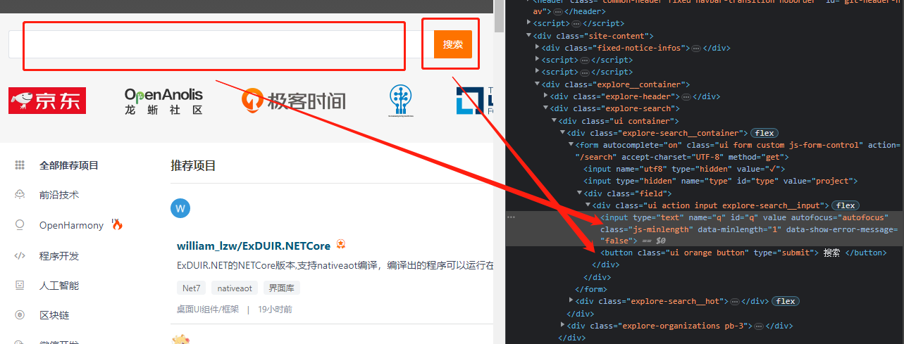
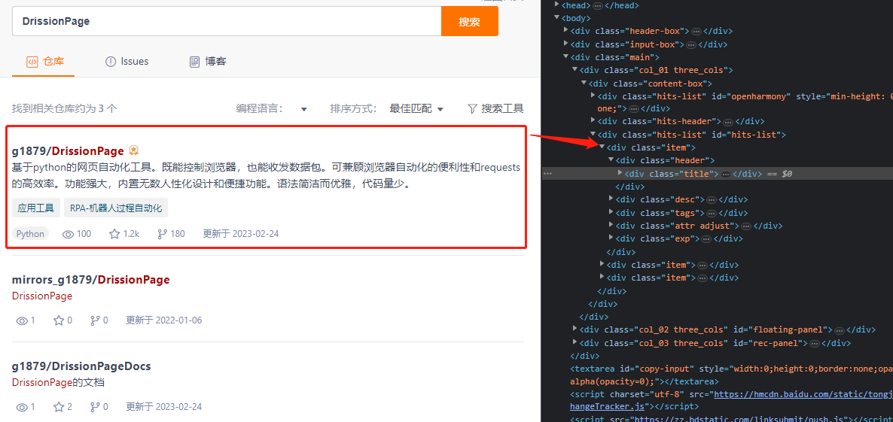

🗺️ Switch Mode
---

This example demonstrates how to switch between controlling the browser and sending/receiving packets using the `WebPage`.

Usually, switching modes is used to deal with websites that have strict login checks. The login can be handled by the browser, and then the mode can be switched to sending/receiving packets to collect data.

However, this scenario requires corresponding accounts, which is not convenient for demonstration purposes. In this example, we use the browser to search on gitee and then switch to the mode of sending/receiving packets to read the data. Although this example has little practical significance, it can help understand its working mode.

## ✅️️ Page Analysis

URL: [https://gitee.com/explore](https://gitee.com/explore)

When we open the URL and press `F12`, we can see the page's HTML as follows:



The input box `<input>` element has an `id` attribute of `'q'`, and the search button `<button>` element's `text` contains the text `'搜索'` (search), which can be used as conditions to find elements.

After entering a keyword and searching, we can view the page's HTML again:



By analyzing the HTML code, we can see that the titles of each result are inside elements with an `id` of `'hits-list'` and a `class` of `'item'`. Therefore, we can retrieve all these elements in the page and then traverse to obtain their information.

---

## ✅️️ Example Code

You can directly run the following code:

```python
from DrissionPage import WebPage

# Create a page object
page = WebPage()
# Access the URL
page.get('https://gitee.com/explore')
# Find the text box element and enter the keyword
page('#q').input('DrissionPage')
# Click the search button
page('t:button@tx():搜索').click()
# Wait for the page to load
page.wait.load_start()
# Switch to packet mode
page.change_mode()
# Get all row elements
items = page('#hits-list').eles('.item')
# Traverse the retrieved elements
for item in items:
    # Print the element's text
    print(item('.title').text)
    print(item('.desc').text)
    print()
```

**Output:**

```shell
g1879/DrissionPage
A web automation tool based on Python. It can control the browser and send/receive packets. It can combine the convenience of browser automation and the efficiency of requests. It has powerful features and built-in humanized designs and convenient functions. The syntax is concise and elegant, with minimal code.

mirrors_g1879/DrissionPage
DrissionPage

g1879/DrissionPageDocs
Documentation for DrissionPage
```

---

## ✅️️ Example Explanation

Let's go through the code line by line:

```python
from DrissionPage import WebPage
```

↑ First, we import the `WebPage` class from the `DrissionPage` module.

```python
page = WebPage()
```

↑ Then, we create a `WebPage` object.

```python
page.get('https://gitee.com/explore')
```

↑ Next, we control the browser to access gitee.

```python
page('#q').input('DrissionPage')
page('t:button@tx():搜索').click()
page.wait.load_start()
```

↑ We simulate entering a keyword and clicking the search button.

The methods used to find elements in this code have been explained in the previous examples and will not be discussed in detail here.

The `wait.load_start()` method is used to wait for the page to enter the loading state, avoiding exceptions caused by too fast operations.

```python
page.change_mode()
```

↑ The `change_mode()` method is used to switch the working mode from controlling the browser to sending/receiving packets.

When switching, the program will re-access the current URL in the new mode.

```python
items = page('#hits-list').eles('.item')
```

↑ After switching, we can use the same syntax as controlling the browser to retrieve page elements. Here, we retrieve all the result rows on the page, and it returns a list of these element objects.

```python
for item in items:
    print(item('.title').text)
    print(item('.desc').text)
    print()
```

↑ Finally, we iterate through these elements and print the text they contain.

